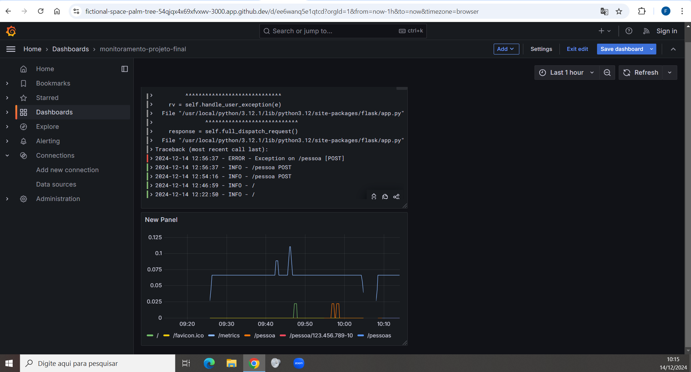

# flask_loki
Aplicação Flask monitorada com Grafana Loki
## Projeto Final monitoramento 
### Alunos
### Fábio José dos Santos
### Jeremias Barbosa de Moura
### Marcos Librelon Raia

### Evidências do exercicio 1 - Projeto Final de Monitoramento - Grafana - Prometheus - Loki

